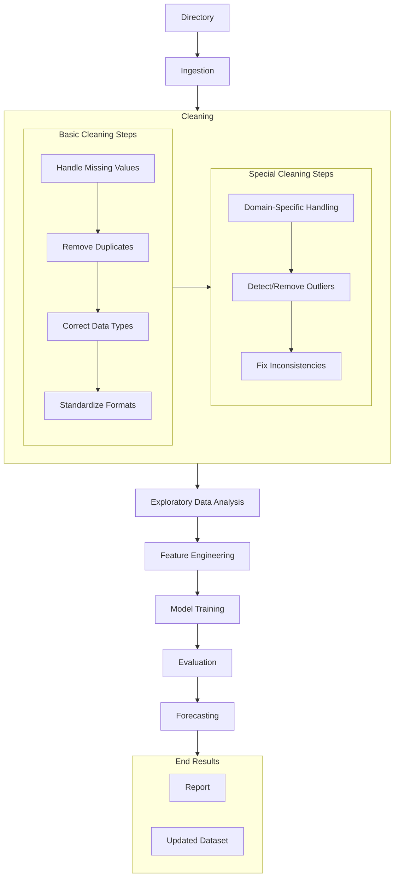

# AdvaDS
> A CLI tool that automates data processing for CSV and JSON files.

## Overview
* **Status:** ✅ MVP
* **Started:** 2025-12-24
* **Core Stack:** [Python, CLI]
* **Domain:** Data Management

## Objectives
To automate data processing workflows including ingestion, cleaning, and basic exploratory analysis for tabular data.

## Tech Stack & Key Concepts
* **Languages:** Python
* **Libraries/Tools:** [e.g., Pandas, Mermaid for diagrams]
* **Key Logic/Algorithms:** Standardized cleaning steps (Missing values, Duplicates, Data types), Outlier detection, and Feature Engineering.

## Roadmap & Features
- [x] **Phase 1: Ingestion & Basic Cleaning** - Handle CSV/JSON ingestion and standard formats.
- [ ] **Phase 2: Advanced EDA** - Automated visualization and report generation.
- [ ] **Phase 3: Forecasting** - Integration of basic predictive modeling.

---

Started: 2025-12-24

