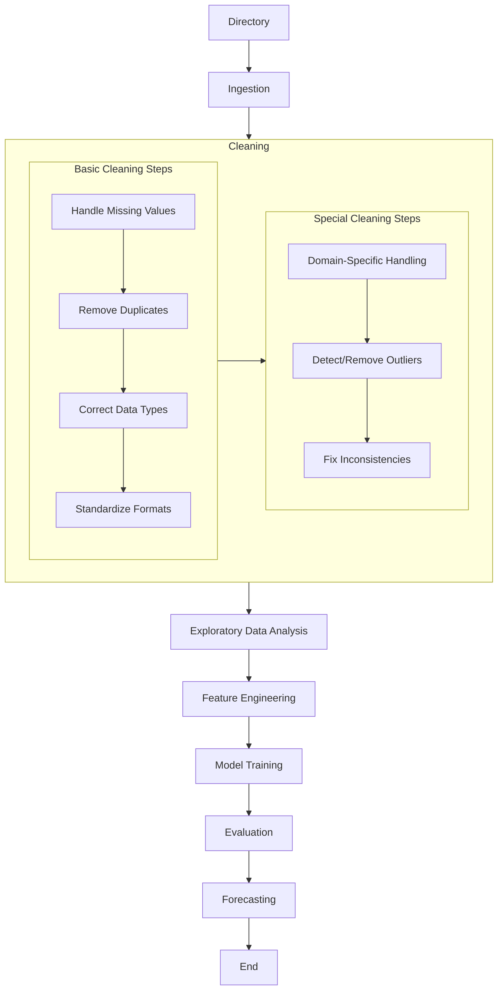

# AdvaDS

A CLI tool that automates data processing for CSV and JSON files.

---

Started: 2025-12-24

```mermaid
graph TD
    A[Directory] --> B[Ingestion]
    B --> Cleaning
    subgraph Cleaning ["Cleaning"]
        subgraph Basic ["Basic Cleaning Steps"];
            direction TB
            C1[Handle Missing Values] --> C2;
            C2[Remove Duplicates] --> C3;
            C3[Correct Data Types] --> C4;
            C4[Standardize Formats]
        end
        subgraph Special ["Special Cleaning Steps"]
            direction TB
            Y[Domain-Specific Handling] --> C5;
            C5[Detect/Remove Outliers] --> C6;
            C6[Fix Inconsistencies]
        end
        Basic --> Special
    end
    Cleaning --> D[Exploratory Data Analysis]
    D --> E[Feature Engineering]
    E --> F[Model Training]
    F --> G[Evaluation]
    G --> H[Forecasting]
    H --> I[End]

```

